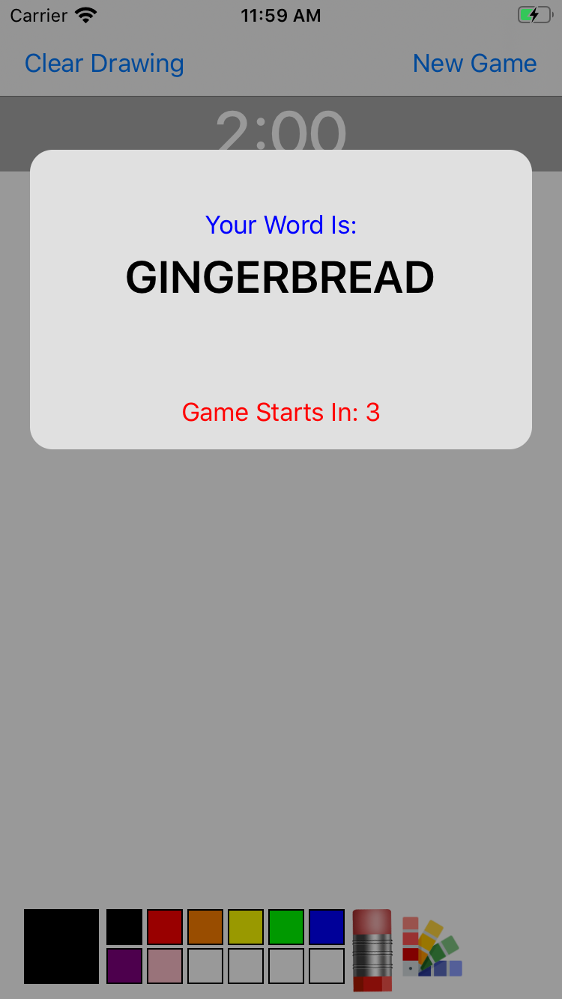
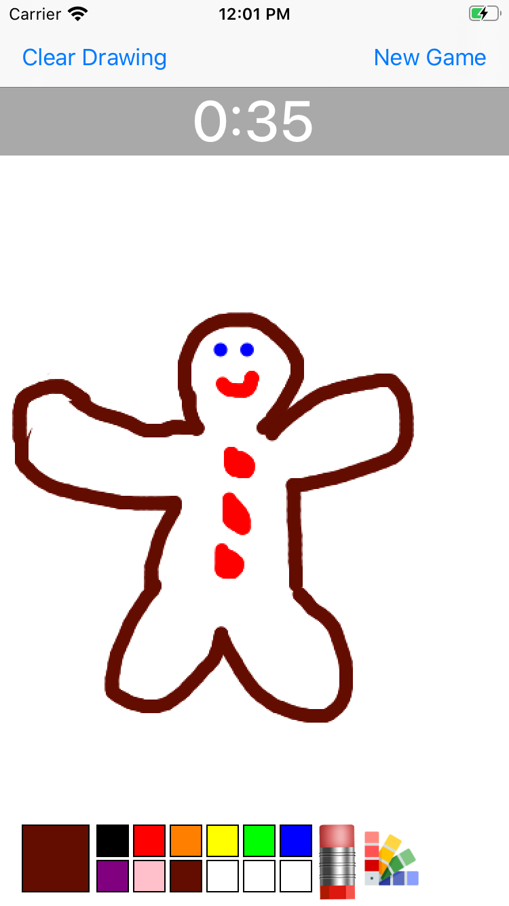
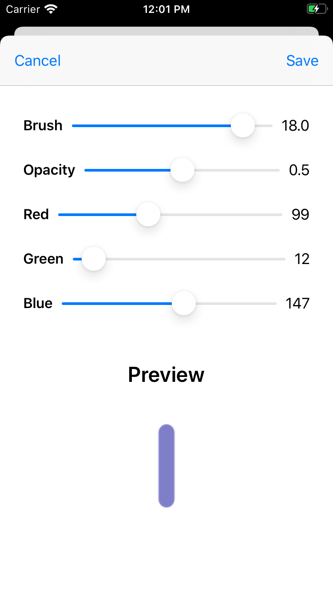

# PictionaryGame
iOS app to play the game Pictionary. The game will generate a random word for the user to draw.

## Screenshots
  

## Motivation
Wanted to create a fun multiplayer game that could be played anywhere.

## Features
* Player can start a new game which will generate a random word to draw
* Game has a countdown timer of two minutes
* Player can create new colors and change the opacity and brush width 
* Option to clear the entire drawing or erase sections of the drawing

## Things I Learned
* Learned how to draw a line when the user touches the screen 
* Utilized tags to differentiate between each color button that can be selected to set the color of the pen
* Used delegation to pass the color, opacity, and brush width settings back to the main drawing page after the user creates a new color

## Future Improvements
* Add counters to keep track of scores
